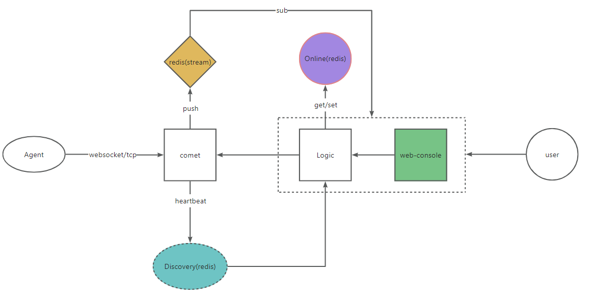

# Jiascheduler

**English** · [简体中文](./README.zh-CN.md)

An open-source, high-performance, scalable, and dynamically configured task scheduler written in Rust that supports pushing user scripts to tens of thousands of instances simultaneously and collecting real-time execution results.

The nodes where jiascheduler executes scripts do not need to be on the same network. It has designed a sophisticated network penetration model that can manage nodes from different subnets with a single console; For example, you can https://jiascheduler.iwannay.cn Simultaneously push script execution to Tencent Cloud, Alibaba Cloud, and Amazon Cloud, and of course, you can deploy script execution to your home computer.

In order to facilitate node management, jiascheduler also provides a powerful webssh terminal that supports multi session operations, screen splitting, uploading, downloading, and more.

## Architecture



##

[https://jiascheduler.iwannay.cn](https://jiascheduler.iwannay.cn)
guest account：guest Password：guest

At this time, there are no online nodes under the guest account. You can deploy the agent yourself, and the successfully deployed agent will automatically connect to the jiascheduler online console. You can check the status of the agent, execute scripts, and view the execution results in the console.

```bash
# Only use job scheduling capability
./jiascheduler-agent --comet-addr ws://115.159.194.153:3000 --assign-username guest --assign-password guest

# Utilize job scheduling and webssh capabilities
./jiascheduler-agent --comet-addr ws://115.159.194.153:3000 --assign-username guest --assign-password guest --ssh-user your_ssh_user --ssh-port 22 --ssh-password your_ssh_user_password --namespace home
```

If you need to log off the node, simply exit the agent

**Complete installation**

1. Install jiascheduler-console

```bash
# Usage: jiascheduler-console [OPTIONS]

# Options:
#   -d, --debug                        if enable debug mode
#       --bind-addr <BIND_ADDR>        http server listen address, eg: "0.0.0.0:9090"
#       --config <FILE>                where to read config file, you can temporarily overwrite the configuration file using command-line parameters [default: ~/.jiascheduler/console.toml]
#   -h, --help                         Print help
#   -V, --version                      Print version

# The first installation requires specifying --bind-add. After the service starts, access 0.0.0.0:9090, enter the installation interface, and follow the prompts to complete the installation
./jiascheduler-console --bind-addr 0.0.0.0:9090
```

2. Install jiaschduler-comet

```bash
# Usage: jiascheduler-comet [OPTIONS]

# Options:
#   -d, --debug            if enable debug mode
#   -b, --bind <BIND>      [default: 0.0.0.0:3000]
#   -r <REDIS_URL>         [default: redis://:wang@127.0.0.1]
#       --secret <SECRET>  [default: rYzBYE+cXbtdMg==]
#   -h, --help             Print help
#   -V, --version          Print version

## Set the Comet listening address, and use the default value for Secret
./jiascheduler-comet --bind 0.0.0.0:3000
```

3. Install jiascheduler-agent

```bash
# Usage: jiascheduler-agent [OPTIONS]

# Options:
#   -d, --debug
#           If enable debug mode
#   -b, --bind <BIND>
#           [default: 0.0.0.0:3001]
#       --comet-addr <COMET_ADDR>
#           [default: ws://127.0.0.1:3000]
#       --output-dir <OUTPUT_DIR>
#           Directory for saving job execution logs [default: ./log]
#       --comet-secret <COMET_SECRET>
#           [default: rYzBYE+cXbtdMg==]
#   -n, --namespace <NAMESPACE>
#           [default: default]
#       --ssh-user <SSH_USER>
#           Set the login user of the instance for SSH remote connection
#       --ssh-password <SSH_PASSWORD>
#           Set the login user's password of the instance for SSH remote connection
#       --ssh-port <SSH_PORT>
#           Set the port of this instance for SSH remote connection
#       --assign-username <ASSIGN_USERNAME>
#           Assign this instance to a user and specify their username
#       --assign-password <ASSIGN_PASSWORD>
#           Assign this instance to a user and specify their password
#   -h, --help
#           Print help
#   -V, --version
#           Print version


# Utilize job scheduling and webssh capabilities
# SSH related configurations can also be omitted and can be configured directly in the console later
./jiascheduler-agent --comet-addr ws://115.159.194.153:3000 --assign-username guest --assign-password guest --ssh-user your_ssh_user --ssh-port 22 --ssh-password your_ssh_user_password --namespace home

```

## Screenshot

<table style="border-collapse: collapse; border: 1px solid black;">
  <tr>
    <td style="padding: 5px;background-color:#fff;"></td>
    <td style="padding: 5px;background-color:#fff;"></td>
  </tr>

  <tr>
    <td style="padding: 5px;background-color:#fff;"></td>
    <td style="padding: 5px;background-color:#fff;"></td>
  </tr>

  <tr>
    <td style="padding: 5px;background-color:#fff;"></td>
    <td style="padding: 5px;background-color:#fff;"></td>
  </tr>

</table>

## Help video

## Buy me a coffee

**wechat:** cg1472580369


